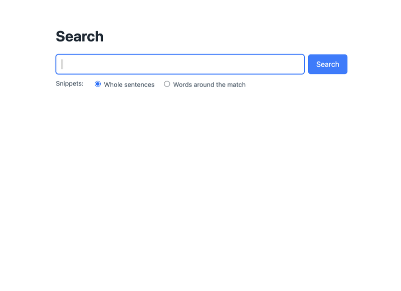

# RawSearch

A highly customizable text search for Craft CMS 6 with weighted results and result snippets.



> The demo search page of the [development environment](#development-and-tests): autocomplete, AJAX results and sentence snippets.

## Features

* Own search index, configurable in the control panel:
  * Words that should not be indexed
  * Field types, fields and element types that should be indexed
* Weighted sorting: points for (partial) matches in titles and fields, per field and per element type
* Result snippets with highlighted words: whole sentences or an adjustable word radius
* Search modes: exact word, word start and word content, words combined with AND or OR
* Multi-site, Matrix/Neo content is indexed as part of its owner
* Only live elements are returned (disabled, pending and expired entries are filtered out)
* Autocomplete
* JSON API
* Search statistic (queries are not stored in dev mode)
* Events to customize indexing, searching and sorting
* Console commands to build the index

## Requirements

* Craft CMS 6.0+ (for Craft 5, use version 1.x)
* PHP 8.5+
* MySQL 8 / MariaDB (fulltext index) or PostgreSQL (searches with `LIKE`, slower on big sites)

## Installation

```bash
composer require oncode/craft-rawsearch
php craft plugin/install rawsearch
```

The installation pushes queue jobs that build the search index of the existing content (make sure a queue worker runs, e.g. `php artisan queue:work`).
Afterwards the index is kept up to date whenever elements are saved, deleted or restored.

You can rebuild the index anytime:

```bash
php craft rawsearch/index/all                  # all indexed element types
php craft rawsearch/index/element-types entry  # specific element types
php craft rawsearch/index/elements 12,34       # specific elements
php craft rawsearch/index/all --queue          # push queue jobs instead
php craft rawsearch/api-key/generate           # generate a new API key
```

## Usage

```twig


<form action="{{ url('search') }}">
    <input type="search" name="query" value="{{ query }}">
    <button>Search</button>
</form>


    

    
        <p>{{ search.total }} results for "{{ query }}"</p>

        <ul>
            
                <li>
                    <a href="{{ result.url }}">{{ result.title }}</a>

                    
                        {# "…" where the text was cut, " … " between the snippets #}
                        <p>
                            
                                …
                                {{- extract.text|raw -}}
                                 … …
                            
                        </p>
                    
                        {# no snippet, e.g. only the title matched: show a description instead if you want
                           (a field of your own or the description of your SEO plugin) #}
                        
                        
                        
                            <p>{{ description }}</p>
                        
                    
                </li>
            
        </ul>

        
        
            <nav class="pagination">
                
                    <a href="{{ pagination.prevUrl }}">Previous</a>
                
                
                    <a href="{{ url }}">{{ page }}</a>
                
                <span aria-current="page">{{ pagination.currentPage }}</span>
                
                    <a href="{{ url }}">{{ page }}</a>
                
                
                    <a href="{{ pagination.nextUrl }}">Next</a>
                
            </nav>
        
    
        <p>No results found.</p>
    

    
        <p>Please enter at least 3 characters.</p>
    

```

`extract.text` is HTML escaped, only the wrap code (`<mark>`) is raw, so `|raw` is safe.

### Search params

| Param | Default | Description |
| --- | --- | --- |
| `query` | | Query to search for (required). |
| `site` | current site | Site handle, id or model. |
| `elementTypes` | all | Element types, as class names or short names (`['entry', 'asset']` or `'Entry,Asset'`). |
| `or` | `false` | Whether the words are combined with OR instead of AND. With AND, every word has to be found somewhere in the element. |
| `mode` | `2` | `1` = exact word, `2` = word start, `3` = word content. |
| `resultsPerPage` | `10` | Results per page. |
| `page` | current page | Page to show, defaults to the page of the request (`page-trigger`). |
| `weightedSort` | `true` | Sort by the weight configuration. |
| `status` | `'default'` | Status passed to the element queries. `'default'` uses the default of the element type (e.g. live entries only), `null` returns any status. |
| `statistic` | `true` | Store the query for the statistic (if enabled in the settings). |
| `extract.enabled` | `true` | Whether snippets are generated. |
| `extract.type` | `'sentences'` | `'sentences'`: the whole sentences that contain the found words, neighboring sentences are merged. `'words'`: the words around the found words (`radius`). |
| `extract.maxLength` | `200` | Sentence snippets only: max characters, longer sentences are shortened to the words around the found words (`radius`). |
| `extract.radius` | `4` | Words shown around a found word (word snippets and shortened sentences). |
| `extract.limit` | `10` | Max snippets per element. |
| `extract.wrap` | `<mark>{phrase}</mark>` | Code wrapped around the found words. |

Sentences end at `.`, `!`, `?`, `…` (and `。！？`) followed by a word that doesn't start lowercase, and at line breaks, paragraphs, headings and list items. Abbreviations like `z.B.`, `e.g.`, `Dr.` and dates like `12. Mai` don't end a sentence.
`isAtStart`/`isAtEnd` of an extract are `false` where text was cut off, show "…" there (like the example above does).

### Result

`search` returns `results`, `pagination` (a `Paginate` variable like `` provides) and `total`.
Each result contains:

* `element` – the element
* `elementId`, `type`, `title`, `url`, `uri`, `slug`
* `score` – weight score (in dev mode `_score` explains how it was calculated)
* `wordsFound` – number of found words in the element
* `extracts` – snippets of all fields (`nr`, `text`, `textParts`, `words`, `isAtStart`, `isAtEnd`)
* `rows` – the matching index rows (`attribute`, `fieldId`, `snippets`) if you need the snippets per field

### Other template functions

```twig
{# autocomplete: words starting with "env" #}

{{ word.word }} ({{ word.elements|length }})

{# results rendered with the same template the API uses for html=1 #}
{{ craft.rawSearch.renderResults(search, query) }}

{# most searched queries #}


{# settings #}
{{ craft.rawSearch.settings.titleMatchWeight }}
```

## JSON API

All actions accept GET or POST params.

### Search

```
/actions/rawsearch/api/search?query=Test
```

Params: `query`, `site`, `elementTypes` (comma separated), `or`, `mode`, `page`, `resultsPerPage`, `weightedSort`, `extract` (array or `0` to disable) and `html`.

With `html=1` the result is rendered HTML. The default template can be overridden by creating `templates/rawsearch/_search.twig` (variables: `search`, `query`). `craft.rawSearch.renderResults()` uses the same template, so server rendered and AJAX results look the same.

Response: `error`, `total`, `pagination` (`first`, `last`, `total`, `currentPage`, `totalPages`) and `result`. Errors return `error: true` with a `message` and a 400/500 status.

### Autocomplete

```
/actions/rawsearch/api/autocomplete?query=Tes&limit=8
```

Params: `query`, `site`, `elementTypes`, `limit` (keeps the most frequent words).

Returns the words starting with the query (alphabetically, with their original spelling):

```json
{"error": false, "result": [{"word": "Test", "results": 5, "elements": [{"id": 12, "type": "CraftCms\\Cms\\Entry\\Elements\\Entry", "count": 3}]}]}
```

* `results` – number of results a search for the word finds. The search matches word starts, so this includes elements with longer words (`Tests`, `Testing`).
* `elements` – the elements that contain exactly this word, `count` is the number of occurrences in the element.

Only words of live elements are returned. Words that differ in case only are merged.

### Actions that require the API key

The API key is generated on installation and can be found under Settings → General (admins only). Logged in users with the matching permission don't need the key.

```
/actions/rawsearch/api/reindex-elements?elementIds=1,2,3&key=API_KEY
/actions/rawsearch/api/reindex-element-types?elementTypes=entry,asset&key=API_KEY
/actions/rawsearch/api/reindex-element-types?all=1&key=API_KEY
/actions/rawsearch/api/queries?site=en&limit=10&key=API_KEY
```

## Configuration

Create `config/craft/rawsearch.php` to override settings:

```php
<?php

return [
    'memoryLimit' => '512M',          // memory limit while indexing
    'rowLimitSearch' => null,         // max index rows fetched per search
    'rowLimitAutocompleteSearch' => null,
    'blacklistedWords' => 'and,or,the',
];
```

## Events

Every event is its own class in `oncode\rawsearch\events`, listen to it with Laravel's `Event::listen()`, e.g. in the `boot()` method of a service provider or module.

```php
use CraftCms\Cms\Database\Table;
use CraftCms\Cms\Element\Queries\EntryQuery;
use CraftCms\Cms\Support\Facades\Sections;
use CraftCms\Cms\Support\Query;
use Illuminate\Support\Facades\Event;
use oncode\rawsearch\events\ElementIndexing;
use oncode\rawsearch\events\ElementQueryResolving;
use oncode\rawsearch\events\ResultRowsResolving;
use oncode\rawsearch\events\ScoreResolving;
use oncode\rawsearch\events\SearchQueryResolving;

// only search entries of a specific section
Event::listen(ElementQueryResolving::class, function(ElementQueryResolving $event) {
    if ($event->query instanceof EntryQuery) {
        $event->query->section('news');
    }
});

// don't find news entries that are older than 3 years
Event::listen(ElementQueryResolving::class, function(ElementQueryResolving $event) {
    $news = Sections::getSectionByHandle('news');

    if ($news && $event->query instanceof EntryQuery) {
        $event->query->where(fn($query) => $query
            ->where('entries.sectionId', '<>', $news->id)
            ->orWhere('entries.postDate', '>=', Query::prepareDateForDb(new \DateTime('-3 years'))));
    }
});

// modify the db query (Laravel query builder) that searches the index, the index table has the alias `rawsearch`
Event::listen(SearchQueryResolving::class, function(SearchQueryResolving $event) {
    $event->dbQuery->whereNotIn('rawsearch.elementId', [1361, 1362]);
});

// add custom results on top (rows without `elementId` are passed through)
Event::listen(ResultRowsResolving::class, function(ResultRowsResolving $event) {
    array_unshift($event->rows, ['type' => 'SPECIAL', 'title' => 'Contact', 'url' => '/contact']);
});

// boost elements
Event::listen(ScoreResolving::class, function(ScoreResolving $event) {
    if ($event->elementRow['elementId'] === 12) {
        $event->score += 3000;
    }
});

// show entries of the "pages" section first:
// join the section of the entries to the index rows, then use it in the score event
Event::listen(SearchQueryResolving::class, function(SearchQueryResolving $event) {
    $event->dbQuery
        ->addSelect('entries.sectionId')
        ->leftJoin(Table::ENTRIES, 'entries.id', '=', 'rawsearch.elementId');
});

Event::listen(ScoreResolving::class, function(ScoreResolving $event) {
    $pages = Sections::getSectionByHandle('pages');
    $sectionId = $event->elementRow['rows'][0]['sectionId'] ?? null;

    if ($pages && (int)$sectionId === $pages->id) {
        $event->score += 3000;
    }
});

// don't index an element
Event::listen(ElementIndexing::class, function(ElementIndexing $event) {
    $event->isValid = $event->element->id !== 25;
});
```

| Event | Fired by | Replaces (1.x) |
| --- | --- | --- |
| `Searching`, `Searched` | search | `Search::EVENT_BEFORE_SEARCH`, `EVENT_AFTER_SEARCH` |
| `SearchQueryResolving` (`dbQuery`) | search | `Search::EVENT_MODIFY_SEARCH_QUERY` |
| `ElementQueryResolving` (`query`) | search | `Search::EVENT_MODIFY_ELEMENT_QUERY` |
| `ResultRowsResolving` (all rows, sorted), `ResultsResolving` (current page) | search | `Search::EVENT_MODIFY_RESULT_ROWS`, `EVENT_MODIFY_RESULTS` |
| `RowScoreResolving`, `ScoreResolving` | weighted sort | `Sort::EVENT_ADD_WEIGHT_ROW_SCORE`, `EVENT_ADD_WEIGHT_SCORE` |
| `Autocompleting`, `Autocompleted` | autocomplete | `Autocomplete::EVENT_BEFORE_AUTOCOMPLETE`, `EVENT_AFTER_AUTOCOMPLETE` |
| `AutocompleteQueryResolving` (`dbQuery`) | autocomplete | `Autocomplete::EVENT_MODIFY_AUTOCOMPLETE_QUERY` |
| `WordElementDataResolving` | autocomplete | `Autocomplete::EVENT_MODIFY_WORD_ELEMENT_DATA` |
| `TermsResolving` | autocomplete | `Autocomplete::EVENT_MODIFY_TERMS` |
| `ElementIndexing` (`isValid`), `ElementIndexed` | indexing | `Index::EVENT_BEFORE_INDEX_ELEMENT`, `EVENT_AFTER_INDEX_ELEMENT` |
| `AttributeValuesResolving`, `FieldValuesResolving`, `IndexRowsResolving` | indexing | `Index::EVENT_MODIFY_ATTRIBUTE_VALUES`, `EVENT_MODIFY_FIELD_VALUES`, `EVENT_MODIFY_ROWS` |

The event properties are the same as in 1.x. `dbQuery` is a Laravel query builder (`Illuminate\Database\Query\Builder`) instead of `craft\db\Query`.

### Recipe: rank newer content higher

Newer elements get up to 300 points, the bonus halves every 365 days (published today: 300, one year ago: 150, two years ago: 75).
Entries use their post date, other elements their creation date.

```php
use CraftCms\Cms\Database\Table;
use Illuminate\Support\Facades\Event;
use oncode\rawsearch\events\ScoreResolving;
use oncode\rawsearch\events\SearchQueryResolving;

// add the date of every element to the index rows
// (own table aliases, so it can be combined with other joins like the section boost above)
Event::listen(SearchQueryResolving::class, function(SearchQueryResolving $event) {
    $grammar = $event->dbQuery->getGrammar();
    $event->dbQuery
        ->selectRaw(sprintf(
            'COALESCE(%s, %s) AS %s',
            $grammar->wrap('dateEntries.postDate'),
            $grammar->wrap('dateElements.dateCreated'),
            $grammar->wrap('relevanceDate'),
        ))
        ->leftJoin(Table::ENTRIES . ' as dateEntries', 'dateEntries.id', '=', 'rawsearch.elementId')
        ->leftJoin(Table::ELEMENTS . ' as dateElements', 'dateElements.id', '=', 'rawsearch.elementId');
});

Event::listen(ScoreResolving::class, function(ScoreResolving $event) {
    $date = $event->elementRow['rows'][0]['relevanceDate'] ?? null;

    if ($date) {
        // dates are stored in UTC
        $ageDays = max(0, (time() - strtotime($date . ' UTC')) / 86400);
        $event->score += (int)round(300 * 0.5 ** ($ageDays / 365));
    }
});
```

Keep the maximum in the range of a few title matches (100–500), otherwise a weak new match beats a strong old one.
To leave out evergreen content, e.g. the "pages" section, add `dateEntries.sectionId` to the select and skip those elements in the score event.

## Permissions

* Access statistic
* Edit settings
  * Indexing
  * Weight

## Development and tests

`dev/` contains a Docker based Craft 6 installation with the plugin, demo content and a demo search page (autocomplete, AJAX results, sentence/word snippets). It needs Docker only.

```bash
cd dev
./setup.sh      # creates the Craft project in dev/site (about 1–2 minutes)
./test.sh       # runs all tests, e.g. ./test.sh --filter SearchTest
```

* Demo: http://localhost:8089/search (another port: `RAWSEARCH_PORT=8090 ./setup.sh`)
* Control panel: http://localhost:8089/admin (admin / password123)
* Start and stop: `docker compose up -d` / `docker compose stop` in `dev/`
* Set up from scratch: `docker compose down -v && rm -rf site && ./setup.sh`
* Queue jobs: `docker compose exec php php artisan queue:work --stop-when-empty`

The environment runs next to the Craft 5 one of version 1.x (port 8088), they use different Docker projects and databases.
To work on 1.x at the same time, check it out in its own directory, e.g. `git worktree add ../craft-rawsearch-1.x main`, and run its `dev/setup.sh` there.

The plugin is linked into the project, changes apply immediately. The demo templates are in `dev/templates` (linked to `resources/views` of the project), the demo content is created by `dev/seed.php`.

The tests create their own site, fields, section and entries with unusual words, so they can also run against another Craft installation that has the plugin installed:

```bash
cd /path/to/craft
CRAFT_BASE_PATH=$PWD vendor/bin/phpunit -c /path/to/rawsearch/phpunit.xml.dist
```

The tests run the queue jobs right away (sync queue). Set `RAWSEARCH_TEST_URL` to the site URL of that installation to run the API tests too, they are skipped otherwise.
